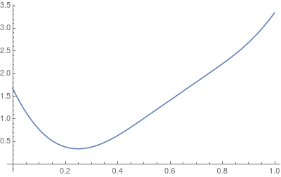
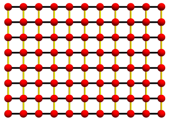
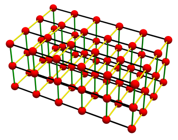

# uniform_bspline_ceres {#mainpage}

Ceres-backed optimization and fitting for uniform B-splines.

This library provides the glue between [uniform_bspline](https://github.com/KIT-MRT/uniform_bspline) and the [Ceres Solver](http://ceres-solver.org/), making it straightforward to fit or optimize B-spline control points inside a Ceres optimization problem.

- **Source**: https://github.com/KIT-MRT/uniform_bspline_ceres
- **License**: Boost Software License 1.0
- **Language**: C++17 (Python &ge; 3.8 for bindings)

---

## Background

[Ceres Solver](http://ceres-solver.org/) is a general non-linear least-squares optimizer.
To optimize B-spline parameters inside Ceres, a cost functor must evaluate the spline
(and its Jacobians) with respect to the control points or evaluation position.

This library bridges [uniform_bspline](https://github.com/KIT-MRT/uniform_bspline) and Ceres
by providing two complementary APIs:

- **Evaluator API** — the spline parameter position is *fixed* at problem-build time; only the
  control points are optimized. This is the common case for spline fitting.
- **Generator API** — the spline parameter position is *itself an optimization variable*,
  enabling joint optimization of control points and evaluation positions (e.g. finding a
  spline minimum or aligning a spline to data with unknown correspondence).

Both APIs are **header-only** and fully compatible with Ceres's automatic differentiation
(`ceres::AutoDiffCostFunction` / `ceres::DynamicAutoDiffCostFunction`).

---

## Design overview

The central class is ubs::UniformBSplineCeres, which wraps a ubs::UniformBSpline and
manages its control-point parameter blocks for Ceres:

```cpp
template <typename Spline>
class UniformBSplineCeres;
```

The workflow for the **Evaluator API** is:

1. Call `getPointData(t)` to obtain local evaluation data at parameter `t`.
2. Call `fillParameterPointers(data, ...)` to extract the (up to `Order`) active control-point pointers to pass to `AddResidualBlock`.
3. Call `getEvaluator(data)` to obtain a ubs::UniformBSplineCeresEvaluator, which is stored in the cost functor and evaluates the spline inside `operator()`.

The workflow for the **Generator API** is:

1. Call `getRangeData(lo, hi)` to determine which control points are active over a parameter range.
2. Call `fillParameterPointers(data, ...)` as above, plus add the evaluation position `t` as an additional parameter.
3. Call `getGenerator<Spline>(data)` to obtain a ubs::UniformBSplineCeresGenerator. Inside the cost functor, call `generator(controlPointPtrs, t)` to reconstruct a fully autodiff-capable ubs::UniformBSpline templated on `T`.

Smoothness priors are added via convenience methods on ubs::UniformBSplineCeres:

1. Call `addSmoothnessResiduals<D>(problem, w)` to add an exact 1-D integral of the squared @f$D@f$-th derivative.
2. Call `addSmoothnessResidualsGrid<D>(problem, w)` for a grid approximation for N-D splines (row/column splines).

---

## Key components

- **ubs::UniformBSplineCeres** — wraps a spline and manages parameter blocks for Ceres.
- **ubs::UniformBSplineCeresEvaluator** — evaluates the spline inside a cost functor with autodiff support.
- **ubs::UniformBSplineCeresGenerator** — generates splines from measurements via Ceres.
- **ubs::UniformBSplineCeres::addSmoothnessResiduals** — exact 1-D integral smoothness regularization.
- **ubs::UniformBSplineCeres::addSmoothnessResidualsGrid** — grid-based smoothness regularization for N-D splines.
- **SplineFitter** (Python) — fits spline control points to (x, y) data via Ceres.
- **SplinePositionFinder** (Python) — given a fitted spline, finds the query position @f$t^*@f$ that maps to a target value.

---

## C++ Usage

### Optimizing the spline with the Evaluator API

In this example we build and solve a Ceres problem of fitting a 1D spline to a test function @f$f(x) = e^{2x}@f$, using a degree-3 B-spline. We use 20 control points, all initialized to zero. The spline is fitted over the interval @f$[0, 1]@f$ by minimizing the sum of squared residuals between the spline and the sampled measurements.

Define the spline type and residual functor:

\snippet evaluator_example.cpp Spline
\snippet evaluator_example.cpp Residual

The parameters of the cost functor are the control points. As we use a spline with degree of three, the order is four and we need four control points to evaluate the spline. Those are the input parameters. Using the control points we evaluate the spline using the `splineEvaluator`. The result is stored in `residual` — the distance between the spline value and the measurement.

Initialize the spline and the Ceres wrapper:

\snippet evaluator_example.cpp Init

Set up the problem. For each measurement, `getPointData()` returns the local evaluation data. Use it to retrieve the parameter pointers (passed to `AddResidualBlock`) and the evaluator (passed to the residual). The number of parameter blocks equals the spline order, each of dimension 1:

\snippet evaluator_example.cpp Problem_Setup

A residual is generated for each measurement. `getPointData()` returns the evaluation data at a single parameter position. The returned data is used to retrieve the parameter pointers and the evaluator. The parameter pointers are passed to Ceres during the call to `AddResidualBlock`; the spline evaluator is passed to the residual and used to compute the spline value during optimization. The number of parameter blocks equals the spline order, each of dimension 1 — so for a degree-3 spline the `AutoDiffCostFunction` block sizes are `<1, 1, 1, 1, 1>` (1 residual, 4 × 1 control point).

Solve the problem:

\snippet evaluator_example.cpp Solve

To add a smoothness prior on the first derivative:

\snippet evaluator_example.cpp Smoothing

The first argument is the Ceres problem, the second is the weight (higher = smoother). The template parameter selects the derivative order used for smoothing.

For the grid-based approximation (N-D splines):

\snippet evaluator_example.cpp Smoothing_Grid

To see the full example see \ref evaluator_example.cpp "evaluator_example.cpp".

---

### Optimizing the evaluation position with the Generator API

When the spline parameter `t` is itself an optimization variable, use the Generator API.

As an example we search for a minimum of a 1D &rarr; 1D spline while keeping the control points fixed. The spline will look like this:



First define the spline type. It is templated on the scalar type `T` so that it works both for `double` (problem setup) and `ceres::Jet` (autodiff inside the cost functor):

\snippet generator_example.cpp Spline

Define the residual function. The constructor takes the number of control points and a spline generator. The generator produces an autodiff-capable spline inside the cost functor. Two residuals are evaluated — the spline value and its first derivative at `pos` — so the cost is minimal when the value is minimal and the derivative is zero:

\snippet generator_example.cpp Residual

Initialize the spline and Ceres wrapper with seven control points. `t` is the evaluation point to optimize, initialized to `0.8`:

\snippet generator_example.cpp Init

Get a range data object for @f$ [0.0, 1.0] @f$. The range controls which control points participate in the optimization. If the range spans the full spline domain, all control points are active. If the range is near-zero, only the @f$ O @f$ (order) nearest control points are involved — a tighter range therefore yields a sparser problem:

\snippet generator_example.cpp Range_Data

Build the parameter vector: control point pointers first, then the evaluation point `t`:

\snippet generator_example.cpp Parameter_Pointers

The total number of parameters for the cost functor is the number of active control points plus one for the evaluation position `t`. The first part of the parameter vector holds the control point pointers; the last entry points to `t`.

Create the cost function using `getGenerator`. The template parameter is the spline template template (the spline must accept a single scalar type parameter `T`); this is required because the concrete spline type is not known until autodiff instantiation. Each control point has dimension 1, as does `t`, and the residual has dimension 2:

\snippet generator_example.cpp Cost_Function

The parameter block dimensions are then set: each control point has a dimensionality of 1 and the evaluation position also has a dimension of 1. Because we use the spline value and its first derivative as residuals, the residual dimension is 2.

Add the residual block:

\snippet generator_example.cpp Add_Residual

Constrain `t` to the valid spline interval @f$ [0.0, 1.0] @f$:

\snippet generator_example.cpp Set_Bounds

Fix all control points:

\snippet generator_example.cpp Fix_Control_Points

Solve the problem. With the control points above the minimum will be at `0.25`:

\snippet generator_example.cpp Solve

To see the full example see \ref generator_example.cpp "generator_example.cpp".

---

### Smoothness / Regularization

There are different ways of expressing smoothness of a function. One way is the integral of the squared @f$n@f$-th derivative:

@f[
s_i = \int_0^1 \| f_i^{(n)}(\mathbf{x}) \|^2 \, \mathrm{d}\mathbf{x}
@f]

In the one-dimensional case this can be integrated exactly as a least-squares term:

@f[
s_i = \int_0^1 \| f_i^{(n)}(x) \|^2 \, dx
    = \sum_i^{N-o} \| s \mathbf{B}^{1/2} \mathbf{P}_{i:i+o} \|^2
@f]

where @f$ s \mathbf{B}^{1/2} @f$ is precomputed and @f$ \mathbf{P}_{i:i+o} @f$ are control points @f$ i @f$ to @f$ i+o @f$, with @f$ o @f$ the spline order.

For the one-dimensional case the control points lie on a line:


Here the red dots are the control points and the black line is the one-dimensional spline used for smoothing.

In the two-dimensional case, such an integral can also be solved and efficiently integrated into an NLS problem. For higher-order splines an approximation is implemented using the one-dimensional case. In the two-dimensional case the control points are laid out in a grid:



To smooth such a spline, a one-dimensional spline is created in each grid direction (horizontal and vertical). Those splines are shown in black and yellow.

In the three-dimensional case the control points are organized in a three-dimensional grid. One-dimensional splines in each of the three axis directions are built and used for smoothing (black, yellow and green lines):



To add the exact smoothness residuals to the Ceres problem call `addSmoothnessResiduals`. The first argument is the Ceres problem, the second is the weight. The higher the weight the smoother the function will be. The template parameter is the derivative order used for smoothing.

To add the grid-based approximation (for N-D splines) call `addSmoothnessResidualsGrid` instead.

---

## Python bindings

The Python module `uniform_bspline_ceres` exposes two families of classes:

### SplineFitter — fit control points to data

Given a set of `(x, y)` samples, fit the B-spline control points by solving a Ceres
non-linear least-squares problem internally.

- `SplineFitter1d1d1`–`5` — @f$\mathbb{R} \rightarrow \mathbb{R}@f$, degree 1–5
- `SplineFitter1d3d1`–`5` — @f$\mathbb{R} \rightarrow \mathbb{R}^3@f$, degree 1–5
- `SplineFitter3d1d1`–`5` — @f$\mathbb{R}^3 \rightarrow \mathbb{R}@f$, degree 1–5
- `SplineFitter3d2d1`–`5` — @f$\mathbb{R}^3 \rightarrow \mathbb{R}^2@f$, degree 1–5

All fitters share the same interface:

```python
fitter = ubsc.SplineFitterXdYdZ(num_control_points=20)          # or num_ctrl_x/y/z for grid
fitter.fit(x, y, smoothness_weight=1e-4, smoothness_order=2)    # order: 1, 2, or 3
spline = ubs.UniformBSplineXdYdZ(
    fitter.get_lower_bound(), fitter.get_upper_bound(), fitter.get_control_points()
)
```

As a concrete example, sample a smooth @f$\mathbb{R}^3 \rightarrow \mathbb{R}^2@f$ vector field on a 6×6×6 grid of 3D points. Construct a `SplineFitter3d2d3` with a 5×5×5 control-point grid and call `fit()`, passing the sample positions, the corresponding 2D output values, a smoothness weight, and the derivative order to regularise. The fitter internally builds and solves a Ceres least-squares problem:

\snippet examples.py Fitter3d2d_Python

After fitting, retrieve the control points via `get_control_points()` and the domain bounds via `get_lower_bound()` / `get_upper_bound()`. These can be passed directly to `ubs.UniformBSpline3d2d3` to evaluate the fitted spline at arbitrary positions.

To see the full examples see \ref examples.py "examples.py".

---

### SplinePositionFinder — find the query position on a fixed spline

Given a **fixed** spline (e.g. previously fitted) and a target output value, find the
query position @f$\mathbf{t}^*@f$ that minimises @f$\|f(\mathbf{t}) - \text{target}\|^2@f$.
The control points are held constant; only the position is optimised by Ceres.

- `SplinePositionFinder1d1d1`–`5` — @f$\mathbb{R} \rightarrow \mathbb{R}@f$, optimises scalar @f$t@f$; use case: invert a 1D function
- `SplinePositionFinder1d3d1`–`5` — @f$\mathbb{R} \rightarrow \mathbb{R}^3@f$, optimises scalar @f$t@f$; use case: closest point on a 3D curve
- `SplinePositionFinder3d1d1`–`5` — @f$\mathbb{R}^3 \rightarrow \mathbb{R}@f$, optimises @f$\mathbf{t} \in \mathbb{R}^3@f$; use case: inverse query in a scalar field
- `SplinePositionFinder3d2d1`–`5` — @f$\mathbb{R}^3 \rightarrow \mathbb{R}^2@f$, optimises @f$\mathbf{t} \in \mathbb{R}^3@f$; use case: inverse query in a vector field

Construct a finder from the control points and domain bounds returned by the corresponding fitter, then call `find()` with the target output value and an initial guess for the position:

```python
finder = ubsc.SplinePositionFinderXdYdZ(
    fitter.get_lower_bound(), fitter.get_upper_bound(), fitter.get_control_points()
)
t_opt = finder.find(target=..., initial_t=..., lower_t=..., upper_t=...)
```

In the example below, the vector field spline fitted above is used. We search for the position @f$\mathbf{t}^* \in \mathbb{R}^3@f$ where the field value is closest to `[0, 1]`, starting the search near the origin:

\snippet examples.py PositionFinder3d2d_Python

`find()` returns the optimised position @f$\mathbf{t}^*@f$ as a NumPy array. Optional `lower_t` / `upper_t` keyword arguments bound the search domain.

To see the full examples see \ref examples.py "examples.py".

---

### Custom type combinations

The `bind_spline_fitter_*` and `bind_spline_position_finder_*` helper templates cover
every input/output dimension family (`1d1d`, `1d3d`, `3d1d`, `3d2d`).
To expose a type not included in the default module, call the appropriate helper — or
write a minimal `py::class_<>` directly — in your own pybind11 extension:

**Fitter custom binding:**

\snippet uniform_bspline_ceres_py.cpp CustomBinding_Example

**Position finder custom binding:**

\snippet uniform_bspline_ceres_py.cpp CustomBinding_Example_Finder

To see the full binding source see \ref uniform_bspline_ceres_py.cpp "uniform_bspline_ceres_py.cpp".

### Python tests

The Python binding test suite is in `tests/python/test_uniform_bspline_ceres.py`.
It mirrors the C++ test patterns with class-based tests for all five polynomial
degrees across all four spline families (`1d1d`, `1d3d`, `3d1d`, `3d2d`), analytic
ground-truth accuracy tests, and `test_example_*` functions that exercise every
named snippet in `tests/python/examples.py`.  Run with:

```bash
pytest tests/python/
```
